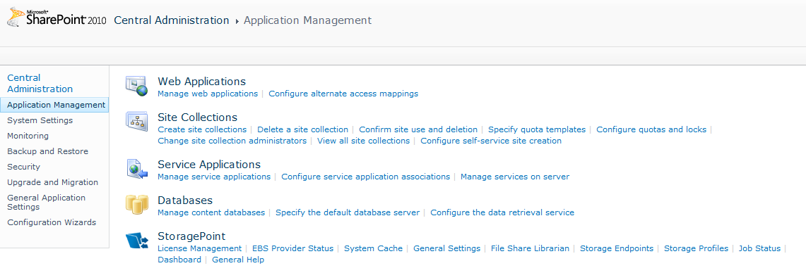
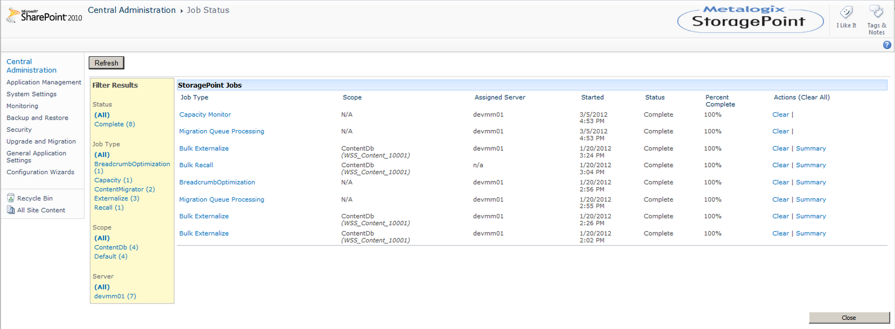

I'm working in a team that builds and maintains a big document management system. Since SharePoint itself is not the best option for storing large amount of files (which can be also quite large) and serving them (performance, content DB size limitations etc.) I was evaluating some options for content externalization. I will not get into much details about the reasons for using such solutions because there are many well written articles about this on the Net (like ["SharePoint 2010: Storing Documents on the File System with Remote Blob Storage"](http://www.simple-talk.com/content/article.aspx?article=1280) by Damon Armstrong). I will focus on one - [Metalogix StoragePoint](http://www.metalogix.com/Products/StoragePoint.aspx).  

I had chance to work with trial Enterprise 3.2.0.17 version of this product (with SP2010), so if you plan using the Standard version some features described bellow might not work.  

## General concept

Metalogix StoragePoint is a content externalization solution for SharePoint that works on both EBS (External BLOB Storage) and RBS (Remote BLOB Storage) levels. The first one is an option for SQL pre-2008R2 backend and also adds some features (higher granularity of externalization scopes such as site collections or lists). RBS came up with SQL 2008R2, so this kind of integration works well with SP2010. StoragePoint installation requires additional DB in SQL in order to maintain mappings between SharePoint items and target BLOBs location (and for its internal configuration).

Target storage is defined as Endpoint. For each Endpoint SP administrator defines storage type (like file system or cloud), storage specific configuration (i.e. UNC path, credentials) and choose if the synchronization will be performed synchronously or asynchronously. Generally operations (endpoint selection and writing the BLOB) performed synchronously are blocking the user control while asynchronous operations use timer job (BLOB Migration Agent) with cache (a special additionally configured endpoint) in order to behave like the name suggests.  
Also additional rules can be applied here - how big must be the attachment to be stored externally, when the endpoint should be treated as offline, warning notifications, compression, encryption (128-bit AES) etc.  

Externalization configurations are grouped into profiles. Each profile defines a scope (web application, content db, site collection or lower), one or more endpoints and additional externalization rules. Despite the fact that more than one endpoint can be defined in profile only one will be used for storing the particular BLOB.  

StoragePoint integrates its admin pages with central administration so all this configuration and operations can be performed in SharePoint in one place.  

## Features

It supports many target storage types (adapters) including clouds: file system, EMC Atmos, EMC Centera, Hitachi HCAP, Windows Azure, Amazon S3, Rackspace Cloud Files (CloudFS), Dell DX, Carringo CAStor and AT&T Synaptic. It's a good choice even if you plan using only the file system connector since it supports SMB shares (OOB SQL FileStream RBS provider allows using only paths on local machine). What I'm missing is the support for FTP (available i.e. in [AvePoint DocAve](http://www.avepoint.com/sharepoint-products)).  

Administrator can define how BLOBs will be organized on target storage. He can choose flat or folder based tree structure (including lists). Files can preserve its names and extensions (with additional GUID and version number to avoid filename collisions). For some further custom development meta-data export (to the same place where BLOBs are stored; in XML format) may be also a useful feature.  

Rules that can be defined in storage profile in order to choose the right target endpoint are based on file size (i.e. send all attachments smaller than 500MB to Amazon 3S cloud and bigger to the local file system) or file type (like doc, pdf etc.). They can be applied selectively to specific SharePoint lists or folders.  

StoragePoint allows also to create additional rules for BLOB archiving (scheduled). It includes: item modification/creation date, related meta-data modification date, file (attachment) modification date and version retention.  

Target storages are monitored by a SharePoint job. E-mail notifications with warnings can be setup when total BLOBs size exceeds the limit defined for particular endpoint. Orphaned BLOBs (files with deleted SharePoint items) are also cleaned up by separate scheduled job (it's the standard RBS/EBS approach recommended by MS). In cases where StoragePoint is being installed on existing SharePoint farm and externalization is setup for existing data the BLOBs can be externalized in the same scheduled manner as well as migrating the files back to contend db. Migration of the content between endpoints is also supported.  

More details about the product can be found in [documentation](http://www.metalogix.com/Libraries/Product_Collateral/StoragePoint_Installation_and_Administration_Guide.pdf).  

## Conclusion

In my opinion Metalogix StoragePoint is a very advanced EBS/RBR solution with rich functionality. It's relatively easy for configuration and maintenance. The minus is lack of FTP support and simultaneous writing to all endpoints defined for one profile (or at least I didn't manage to configure it in that way).  

I know that this description is very brief but It's rather an general overview on product capabilities from developers perspective than exhaustive article.  

Happy SharePointing!

