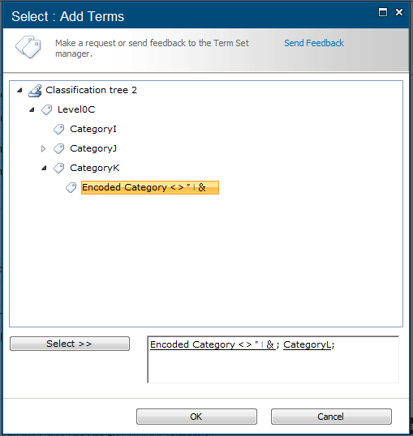
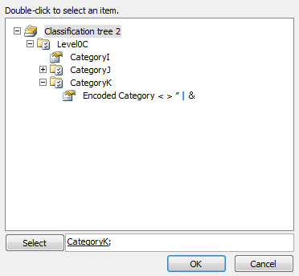
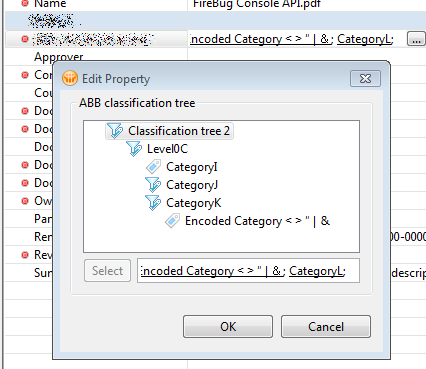
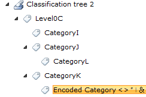

Recently, when I was working on mechanism of automatic synchronization of tree structures provided by web service to SharePoint taxonomies, I came across an error like this:  

```text
The value '(<= 0320-775, 0550-5/7)' is invalid. It probably contains invalid characters or is too long.  
Parameter name: name  
```

with the following stacktrace fragment:  

```text
at Microsoft.SharePoint.Taxonomy.Internal.CommonValidator.ValidateName(String name, String parameterName)  
at Microsoft.SharePoint.Taxonomy.TermSetItem.CreateTerm(String name, Int32 lcid, Guid newTermId)  
...  
```


Looking for some help in SharePoint API documentation for method [TermSetItem.CreateTerm()](http://msdn.microsoft.com/en-us/library/ee583797.aspx) I found the explanation for this error:  

> The labelName value will be normailized to trim consecutive spaces into one and replace the & character with the wide character version of the character (\\uFF06). It must be non-empty, cannot exceed 255 characters, and cannot contain any of the following characters ;"< >|&tab

Yeah, this is SharePoint... No surprise, I would say ;)  

Since I had to put the forbidden characters into the term labels somehow, my first thought was to encode them as HTML entities. But as you may noticed it is impossible - the ampersand character is replaced by similar looking unicode character with code `\uFF06`.  

My second try - why not to try the same as MS SharePoint developers? You will find many UTF-16 characters that look almost exactly the same as the characters from ASCII set. The replacements for the forbidden characters in UTF-8 are:  

Original ASCII char | UTF-8 replacement code | UTF-8 char
:-------------------|:-----------------------|:-----------
\                   | \\uFF5C                | ｜
"                   | \\uFF02                | ＂         
<                   | \\uFF1C                | ＜         
\>                  | \\uFF1E                | ＞         

Unfortunetly I found no replacement for semicolon character so I'm replacing it with coma. You can find more information about these characters on [FileFormat](http://www.fileformat.info/info/unicode).  

Of course you will have to create the term grammatically to put them into term label (or copy them from some unicode table, such as [FileFormat](http://www.fileformat.info/info/unicode)). Here is a utility method that should "normalize" the strings for `CreateTerm()` method:  

```csharp
public static string ReplaceIllegalCharacters(string termLabel)  
{  
    return termLabel.  
        Replace("\t", " ").  
        Replace(";", ",").  
        Replace("\"", "\uFF02").  
        Replace("<", "\uFF1C").  
        Replace(">", "\uFF1E").  
        Replace("|", "\uFF5C");  
}  
```

This works fine either in web interface and other clients (I've tested it with MS Word 2010 and Lotus Notes widget for SharePoint integration - [Harmon.IE](http://harmon.ie/)). ~~I will put here some screenshots soon.~~

[](sp_mmd_picker.png)

[](word_mmd_picker.png)

[](harmonie_mmd_picker.png)

[](term_store_management_tool.png)

Happy SharePointing!

