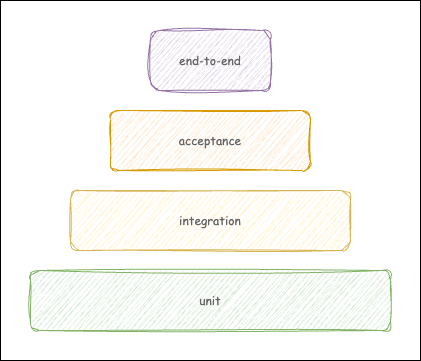
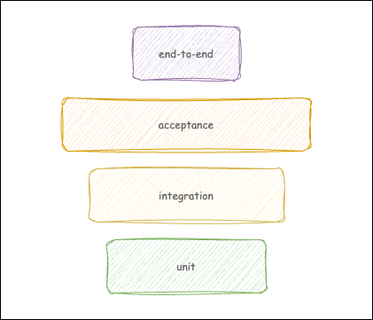

---
categories:
- testing
date: "2025-02-08T00:00:00Z"
tags:
- unit tests
- acceptance tests
title: Do we still need testing pyramid?
---

This text will be rather reflective than instructional, which can be surprising compared to other articles on this blog. However after almost 7 years without any new text, this shouldn't be any shock, even if you - somehow - managed to follow me here ;-)

I was lucky enough to work at my first professional projects with engineers experienced enough to introduce me to TDD on day one. At that time, the one-and-only testing approach in this craft was the classic testing pyramid: you write a lot of unit test covering almost all your code in isolated manner, much less integration/acceptance tests, and some basic end-to-end tests, mainly for happy paths. (Later came other types and also terminology became to blur.) This looked more or less like this.

The main issue with integration, e2e, acceptance, etc. tests was that they were slow. In fact, I remember they were so slow (and sometimes difficult to run deterministically each time) that running them in the TDD loop was defeating the purpose of methodology. So we were avoiding them as much as possible and the pyramid shape of our test suite seemed perfectly reasonable.

On the other hand, while I could detect some issues with unit tests, many times they were able to detect only the issues related to more complex logic, and large portion of the backend is rather a simple pipeline that maps and passes the data: `HTTP adapter -> controller -> DB/queue/external service`. One simple acceptance test could potentially catch a dozen of bugs. In fact, many of errors I make can be detected only in integration with the database, HTTP server and external services.

As soon as I started using containers in my daily backend development (which was late, around 2018) I realized that the main reasons for writing little integration, acceptance or e2e tests might have just gone away. On a relatively average hardware available for most developers I could run my app along with the Postgres, RabbitMQ, Kafka, etc. Thanks to simulators like Localstack, I could mock most of my cloud environment. I could mock external APIs with Wiremock or similar tool. And everything running within an isolated networked environment in containers. If I needed, I could even inject some network-level issues to test connectivity resilience, as both Docker Compose and Kubernetes allowed for such scenarios.

The next realization was that in such environment my app can be run as close to the production configuration as possible. I don't even have to change hostnames as the container network was kind enough to allow for aliases. (I only need to have a local PKI infrastructure working with my app.) Many, if not the most, of the bugs that sneaked into production was not related to the application logic, as it was often quite simple, but to the typical setup issues - wrong configuration, missing IoC dependencies setup, mistyped environment variable name in the code, etc. Now, I could test all those potential issues with no artificial code added to the production codebase just for testing purposes.

All those realizations and first-hand experience with real production bugs convinced me to change my approach for testing. While I still love TDD for reasons less related with testing (design, speeding up coding), I write much less unit tests now than I used to. I write unit tests mainly when I have more complex logic, validation, error handling, and edge cases that are impractical (because of number of cases and related performance) to code as integration/acceptance tests. It happens that after I write some unit tests to design my code, I delete them as soon I implement some functionality and ensure that it's tested by higher-level tests, treating those tests as scaffold. I write as many integration/acceptance tests as needed to cover most of the app code (with no specific % target on the coverage itself). Together with the blessing of CI, this approach allows teams I work with to move fast with a great quality.

The shape of this testing approach looks more like this.

Of course, the exact proportions will look different for different types of projects. The key point here is that I believe our industry and craft have matured enough, in terms of experience gathered and technical expertise, to move from dogmas to more pragmatic approach. In conjunction with the advancement in tooling and technology, it created a good ground for writing the software efficiently without sacrificing the quality.

I hope you, dear reader, will find this text somehow useful. If you do, please, let me know what you think in comments bellow and share this article with others. 

Have a wonderful day (or night) and see you soon! 
